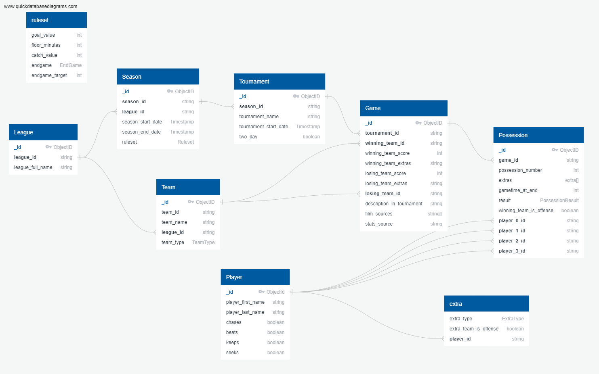

# <b>models.db</b>
## <b>The Canonical Data Model</b>

When exchanging information between multiple interconnected entities. 

### <b>Model</b> 
The models were defined in protobuf, which was specifically chosen due to protobuf's 
- (a)  compactness
- (b)  serializability to json for common data storage formats
- (c)  easy support for the automated creation of object classes in multiple languages including Java, Golang,
        and Python which can be used to support extended functionality in many different types of applications
        using the same data model

All collection objects have _id fields to make them compatible with MongoDB auto id generation

At the highest level sits the League entity. 
* <b>League</b>
    *   An entity that creates seasons of play for its member teams
* <b>Season</b>
    *   A time period of play for a league
    *   A season belongs to a single League, and a Ruleset is defined as a set of rules 
        by which the season is conducted
*  <b>Ruleset</b>
    *   The ruleset object is not usually implemented as a separate collection in database storage
        however, it is the set of rules that determines how a game is played
    *   Throughout the broad history of the sport, the various rulesets can be broadly sumamrized through
        three different enumerated EndGame values
        *   ENDGAME CATCH - A catch of the flag ends the game and grants a certain \# of points to the pulling team.
                            A catch MUST happen to end the game
        *   ENDGAME TIME -  A catch of the flag ends the game and grants a certain \# of points to the pulling team.
                            A catch is not necessary to end a game, because the game also ends on time. This was briefly used as an ruleset in a MLQ Season
        *   ENDGAME SCORE - A catch of the flag does not *necessarily* end the game, but grants a certain \# of
                            points to the pulling team. The game only ends when a certain point total is reached above the leading score at half-time. This *set score* is currently the predominant ruleset used in most leagues. 
    *   We can then summarize ALL of the rulesets used by just point values for goal and catch , halftime time,
        endgame type, as well as endgame value (for time, how many minutes must pass till the end of the game? for score, how many extra points must be reached). 
*   <b>Team</b>
    *   very simply an entity competing in a league
    *   The team entity was specifically designed to operate cross-season to simplify the data model and
        enable easier linkage of a teams games cross-season
*   <b>Tournament</b>
    *   a subset of play occuring in a day or two during a season where Games occur
*   <b>Game</b>
    *   a single match between two teams that results in a winner and a loser 
    *   games often have external information (video, stats) that is stored in the Game object
    *   a game occurs within the scope of a Tournament and consists of many Possessions
*   <b>Possession</b>
    *   The most granular object in our Object Model - a Possession is a period of time where one team
        possesses the quadball (the offense team) until the ball is turned over the the other team (defense)
        in some manner.
    *   Possessions can have a set of enumerated PossessionResults which is the method by which the possession ended
    *   Possessions have a primary and a secondary
        *   the primary (which can be a single person or two) is the person or persons directly responsible for
            bringing about the PossessionResult
        *   the secondary (which can a single person or two) is the person or persons tangentially or at least
            more distantly involved in the PossessionResult than the primary
    *   In some implementations additional information might want to be passed about events thats happened during
        a possession that did not lead to the PossessionResult. An example could be a card given out to a player, a
        timeout taken by a team, etc. These are categorized as "extras" and stored as a list there. 

